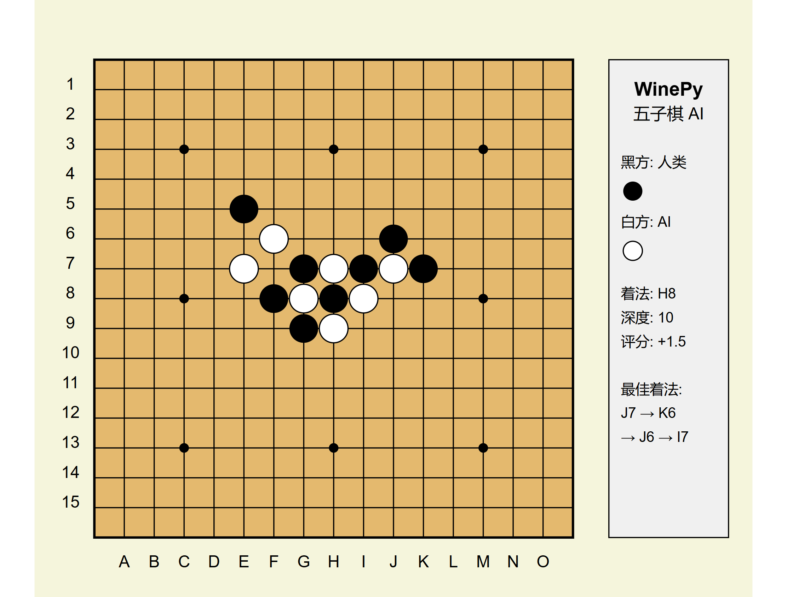

# WinePy: Python Implementation of Wine Gomoku AI

WinePy is a Python implementation of the [Wine](https://github.com/jinjiebang/wine) Gomoku (Five in a Row) AI engine. This project enhances the original C++ implementation with improved AI algorithms, a user-friendly interface, and a data generation system for neural network training.



## Features

- 💪 Powerful Gomoku AI based on alpha-beta search with pattern recognition
- 🎮 Interactive console-based user interface
- 🤖 Computer vs. computer demonstration mode
- 📊 Training data generator for machine learning models
- 🧠 Pre-generated [AI training dataset](https://huggingface.co/datasets/Karesis/Gomoku) available on Hugging Face
- 🏆 Supports Gomocup protocol for competition

## Installation

### Prerequisites

- Python 3.6 or higher
- NumPy (for data generation and storage)

### Setup

1. Clone the repository:
   ```bash
   git clone https://github.com/Karesis/Winepy.git
   ```

2. Install the required dependencies:
   ```bash
   pip install numpy
   ```

## Usage

### Play Against AI

Run the main program to access the menu:

```bash
python main.py
```

Select option 1 to play against the computer. Input moves using coordinates like `h8` (column + row).

### Commands During Game

- `quit` or `exit`: Exit the game
- `restart` or `new`: Start a new game
- `help`: Show help information

### Computer vs. Computer Demo

Select option 2 from the main menu to watch two AI players compete against each other.

### Generate Training Data

Select option 3 from the main menu to generate self-play games for AI training:

1. Specify the number of games to generate
2. Choose the number of parallel processes
3. Set the output directory
4. Select the output data format

The data generator creates a dataset suitable for training neural networks to predict optimal Gomoku moves.

### Gomocup Protocol Mode

Select option 4 to enter Gomocup protocol mode, which allows the AI to interact with other programs using the standard Gomocup protocol.

## Project Structure

- `ai.py`: Implementation of the AI engine and search algorithms
- `board.py`: Game board representation and pattern evaluation
- `main.py`: User interface and main program
- `data_generator.py`: Training data generation for machine learning

## Technical Details

### AI Algorithm

WinePy uses an enhanced alpha-beta search algorithm with the following features:

- Iterative deepening search
- Transposition tables for move caching
- Pattern-based evaluation function
- Threat detection and response
- Improved move ordering for better pruning

### Pattern Recognition

The AI recognizes and evaluates various patterns on the board:

- Connected five (win condition)
- Open four (one move away from winning)
- Blocked four (potential four-in-a-row with one end blocked)
- Open three (two moves away from winning)
- Blocked three (potential three-in-a-row with one end blocked)
- Open two (early stage pattern)
- Blocked two (early stage pattern with one end blocked)

### Data Generation

The data generator creates training examples in two formats:

1. Full board representation (15×15 grid, ML-friendly NumPy format)
2. Sparse representation (original format with move history)

Each training example consists of a board state and the corresponding optimal move as determined by the AI.

**Pre-generated Dataset**: A large dataset of 26,378 examples from 875 games is available on [Hugging Face](https://huggingface.co/datasets/Karesis/Gomoku). This dataset is split into training (80%) and test (20%) sets and is ready for machine learning experiments.

## Contributing

Contributions are welcome! Here are some ways you can contribute:

- Improve the AI evaluation function
- Enhance the user interface
- Optimize the search algorithm
- Add support for different board sizes
- Implement a graphical user interface

## Credits

- Original Wine Gomoku AI: [Wine](https://github.com/jinjiebang/wine) by jinjiebang
- Python implementation and enhancements: [Karesis]

## License

This project is licensed under the MIT License - see the LICENSE file for details.
