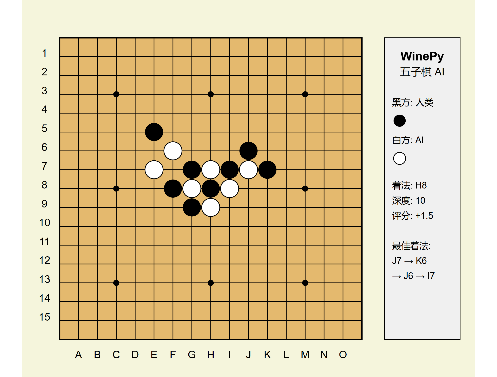

# WinePy: Wine五子棋AI的Python实现

WinePy是[Wine](https://github.com/jinjiebang/wine)五子棋AI引擎的Python实现版本。本项目对原始C++实现进行了增强，改进了AI算法，提供了用户友好的界面，并添加了用于神经网络训练的数据生成系统。



## 特点

- 💪 基于alpha-beta搜索和模式识别的强大五子棋AI
- 🎮 交互式控制台用户界面
- 🤖 电脑对战电脑演示模式
- 📊 用于机器学习模型的训练数据生成器
- 🧠 预生成的[AI训练数据集](https://huggingface.co/datasets/Karesis/Gomoku)可在Hugging Face上获取
- 🏆 支持Gomocup协议用于比赛

## 安装

### 前提条件

- Python 3.6或更高版本
- NumPy（用于数据生成和存储）

### 设置

1. 克隆仓库：
   ```bash
   git clone https://github.com/username/winepy.git
   ```

2. 安装所需依赖：
   ```bash
   pip install numpy
   ```

## 使用方法

### 与AI对弈

运行主程序以访问菜单：

```bash
python main.py
```

选择选项1与电脑对弈。使用坐标输入着子，如`h8`（列+行）。

### 游戏中的命令

- `quit`或`exit`：退出游戏
- `restart`或`new`：开始新游戏
- `help`：显示帮助信息

### 电脑对战电脑演示

从主菜单选择选项2，观看两个AI玩家相互对弈。

### 生成训练数据

从主菜单选择选项3，为AI训练生成自对弈游戏：

1. 指定要生成的游戏数量
2. 选择并行进程数
3. 设置输出目录
4. 选择输出数据格式

数据生成器创建适用于训练神经网络以预测最佳五子棋着法的数据集。

### Gomocup协议模式

选择选项4进入Gomocup协议模式，该模式允许AI使用标准Gomocup协议与其他程序交互。

## 项目结构

- `ai.py`：AI引擎和搜索算法的实现
- `board.py`：游戏棋盘表示和模式评估
- `main.py`：用户界面和主程序
- `data_generator.py`：用于机器学习的训练数据生成

## 技术细节

### AI算法

WinePy使用增强的alpha-beta搜索算法，具有以下特点：

- 迭代加深搜索
- 置换表用于缓存着法
- 基于模式的评估函数
- 威胁检测和响应
- 改进的着法排序以获得更好的剪枝效果

### 模式识别

AI识别并评估棋盘上的各种模式：

- 连五（胜利条件）
- 活四（距离胜利一步）
- 冲四（一端被阻挡的潜在四连）
- 活三（距离胜利两步）
- 眠三（一端被阻挡的潜在三连）
- 活二（早期阶段模式）
- 眠二（一端被阻挡的早期阶段模式）

### 数据生成

数据生成器以两种格式创建训练样例：

1. 完整棋盘表示（15×15网格，适合机器学习的NumPy格式）
2. 稀疏表示（带有着法历史的原始格式）

每个训练样例由一个棋盘状态和AI确定的相应最佳着法组成。

**预生成数据集**：一个包含875局游戏的26,378个样例的大型数据集可在[Hugging Face](https://huggingface.co/datasets/Karesis/Gomoku)上获取。该数据集被分为训练集（80%）和测试集（20%），已准备好用于机器学习实验。

## 贡献

欢迎贡献！以下是一些贡献方式：

- 改进AI评估函数
- 增强用户界面
- 优化搜索算法
- 添加对不同棋盘大小的支持
- 实现图形用户界面

## 致谢

- 原始Wine五子棋AI：jinjiebang的[Wine](https://github.com/jinjiebang/wine)
- Python实现和增强：杨亦锋

## 许可证

本项目采用MIT许可证 - 详情请参阅LICENSE文件。
